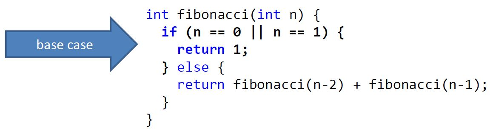
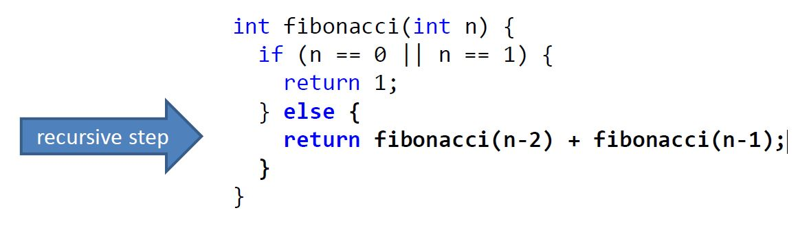
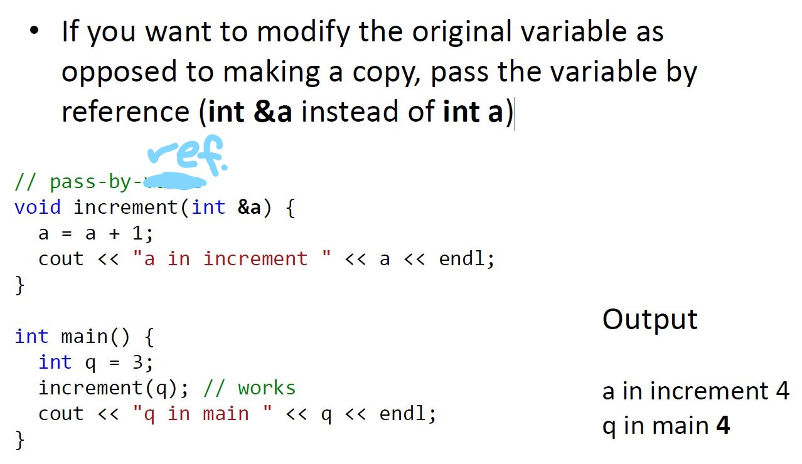

# functions, strings and arrays, pointers

## functions

### Why define your own functions?

- Readability
- Maintainability
- Code reuse

### Function Declaration Syntax

- Must return same type as function return type
- If no values are returned (empty space is a value), give the function a void return type
- You cannot declare a variable of type void
- Preferably don't use global variables

```c++
int raiseToPower(int base, int exponent)
{
  void x; //error
  int result = 1;
  for (int i = 0; i < exponent; i = i + 1) 
  {
    result = result * base;
  }
  return result;
}
```

### Functions can have overloading - same name, different argument type

### Function declarations need to occur before invocations

- Solution 1: reorder function declarations
- Solution 2: use a function prototype; informs the compiler you’ll implement it later
  - Function prototypes should match the signature of the method, though argument names don’t matter
  - Function prototypes are generally put into separate header files

### Random Number Generation Functions

- random-seeming but deterministic sequence based on a seed number (usually current time)
  
  ```c++
  #include <iostream>
  // defines rand(), srand(), RAND_MAX
  #include <cstdlib>
  // C time functions -defines time(
  #include <ctime>

  // time(0) returns current time as a number
  srand(time(0)); // Set the seed;
  int randNum = rand();
  std::cout << "A random number: " << randNum << endl;
  return 0;
  ```

### Default Arguments

- automatically inserts arguments
- constant argument ensures that a reference variable isn't changed

```c++
void printNTimes(char const *msg, int n = 1)
{
    for (int i = 0; i < n; ++i)
    {
        cout << msg;
    }
}
```

### recursion : Functions can call themselves

- fib(n) = fib(n-1) + fib(n-2)



### Pass by value vs by reference



### Swap

```c++
void swap(int &a, int &b) {
  int t = a;
  a = b;
  b = t;
}
int main() {
  int q = 3;
  int r = 5;
  swap(q, r);
  cout << "q " << q << endl; // q 5
  cout << "r " << r << endl; // r 3
}
```

### libraries

- 2 components
  - header file containing the prototypes
  - binary .dll/.so file containing the (compiled) implementation
    - readable by computer, but not human
- Linker locates the implementation of functions in the .dll file at compile time

## Arrays and Strings

### Arrays : store multiple values together as one unit

- one dimensional: type arrayName[size];
- initialization
  - arr[0] = 6;
  - int arr[4] = { 6, 0, 9, 6 };
  - int arr[] = { 6, 0, 9, 6, 2, 0, 1, 1 };
- multi-dimensional: type arrayName[dimension1][dimension2];
- initialization
  - int twoDimArray[2][4] = { 6, 0, 9, 6, 2, 0, 1, 1 };
  - int twoDimArray[2][4] = { { 6, 0, 9, 6 } , { 2, 0, 1, 1 } };
- when multidimensional arrays are specified as arguments to functions, all dimensions but the first must be provided
  - int aFunction(int arr[][4]) { … }
- array as function parameter; arrays are passed by reference

  ```c++
  ##include <iostream>
  using namespace std;

  int sum(const int array[], const int length) {
    long sum = 0;
    for(int i = 0; i < length; sum += array[i++]);
    return sum;
  }

  int main() {
    int arr[] = {1, 2, 3, 4, 5, 6, 7};
    cout << "Sum: " << sum(arr, 7) << endl;
    return 0;
  }
  ```

### strings : a character array

- write string as character array
  - end string with null character : \0

  ```c++
  ##include <iostream>
  using namespace std;

  int main() {
    char helloworld[] = { 'H', 'e', 'l', 'l', 'o', ',', ' ',
    'w', 'o', 'r', 'l', 'd', '!', '\0' };
    cout << helloworld << endl;
    return 0;
  }
  ```

- write character array with string literals
  - no null character needed (automatic)

  ```c++
  char helloworld[] = “Hello, world!”;
  ```

- libraries can manipulate strings
  - StringLibraries.cpp

## Pointers

### \* &

- \* has 2 usages
  - declare pointer : int \*x = &y;
  - dereference value : cout << x; // address of pointer
                        cout << *x; // value inside pointed address

- & has 2 usages
  - indicate a reference data type : int &x = y;
  - take the address of a variable : *ptr = &x;

### Variables and Memory

- &x evaluates to the address of x in memory
- \*( &x ) takes the address of x and dereferences it – retrieves the value at that location in memory. \*( &x ) thus evaluates to the same thing as x

### Pointer Syntax/Usage

- Declaration : int \*ptr = &x;

```c++
void squareByPtr(int *numPtr)
{
  *numPtr = *numPtr * *numPtr;
}

int main()
{
  int x = 5;
  squareByPtr(&x);
  cout << x;
}
```

### const pointers

- const int *ptr; // value can't change
- int * const ptr; // address can't change
- const int * const ptr; // nothing can change

### Null, Uninitialized, and Deallocated Pointers

- the value of a pointer is undefined until it is initialized, so it may be invalid
- null pointers are invalid because they point to invalid data
  - set to 0 to create null pointers

  ```c++
  // nullPointer is an int pointer, address is 0
  int *nullPointer = 0; // null beause memory address 0 doesn't exist
  nullPointer = 5;      // error: cannot assign to null pointer
  ```

  - can't dereference data that has been erased from memory

  ```c++
  int *myFunc()
  {
    int phantom = 4;
    return &phantom; // can't return, phantom doesn't exist outside of function
  }
  ```

### Pointers to Pointers

- First pointer contains the address of the second pointer, which points to the location that contains the actual value

```c++
void swapIntPointerAddress(int **int1, int **int2)
{
  int *temp = *int1;
  *int1 = *int2;
  *int2 = temp;
}
int main()
{
swapIntPointerAddress(&x, &y);
cout << "int1: " << *x << endl;
cout << "int2: " << *y << endl;
}
```

### References

- reference variable is alias for original variable : same value
- references don't need to be dereferenced explicitly

```c++
int w = 6;
int y = 5;
// x is a reference type, same address as y
int &x = &y; // error: &x is already reference, just write y, not &y
int &x = y; // Makes x a reference to, or alias of, y
&x = w; // can't change referenced location, always reference y
```

### Pointers and Arrays

- The name of an array is a pointer to the first element in the array
- arrays are always passed by reference: passing an array is really passing a pointer
- myArray[3] : tells the compiler to return the element that is 3 memory spaces away from the starting element of myArray (0 memory spaces away from first element)
- arrays can contain pointers : const char *suitNames[] = {"Clubs ", "Diamonds "};
- 2 ways to point to array elements
  - int *p = arr;
  - int *q = & arr [0];

## Pointer Arithmetic

- 2 types of notation
  - myArray[3]
  - *(myArray + 3)
    - add your offset to the pointer and dereference the resulting address
- subtraction and addition of pointers to move around between locations in memory, typically between array elements
- compiler uses appropriate step size for arithmetic, +1 means next element, not necessarily next byte

```c++
long arr[] = {6, 0, 9, 7};
long *ptr = arr; // first element (arr[0]), 6
ptr++; // second element (arr[1]), 0
```

```c++
cout << (ptr2 - ptr) << endl; // subtracts memory addresses to find number of elements in between ptr2 and ptr
```

### char * Strings

- When you set a char * to a string, you are really setting a pointer to point to the first character in the array that holds the string
- Cannot modify string literals, but can modify the contents of an array of characters

6

- 6.4
  - the array reference would be out of scope, only exists in function
  - even if returned, only the first element would be returned
