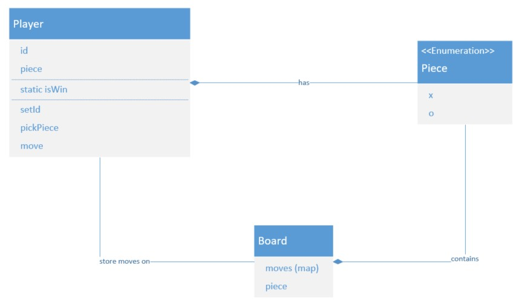
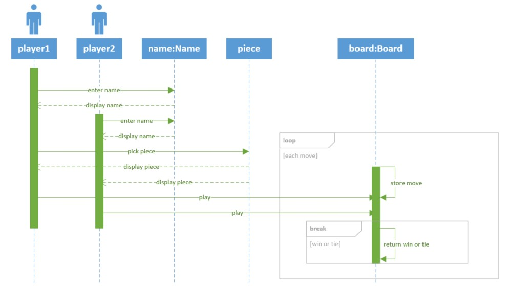

# connect 4

## how to play

- 2 players - player 1 has "X" piece, player 2 has "O" piece
- board set up like chess board
- 2 players alternate taking turns to place pieces on the board
- the first player with 4 pieces in a row (horizontally, diagonally, or vertically) wins

## design

- class diagram

- sequence diagram

