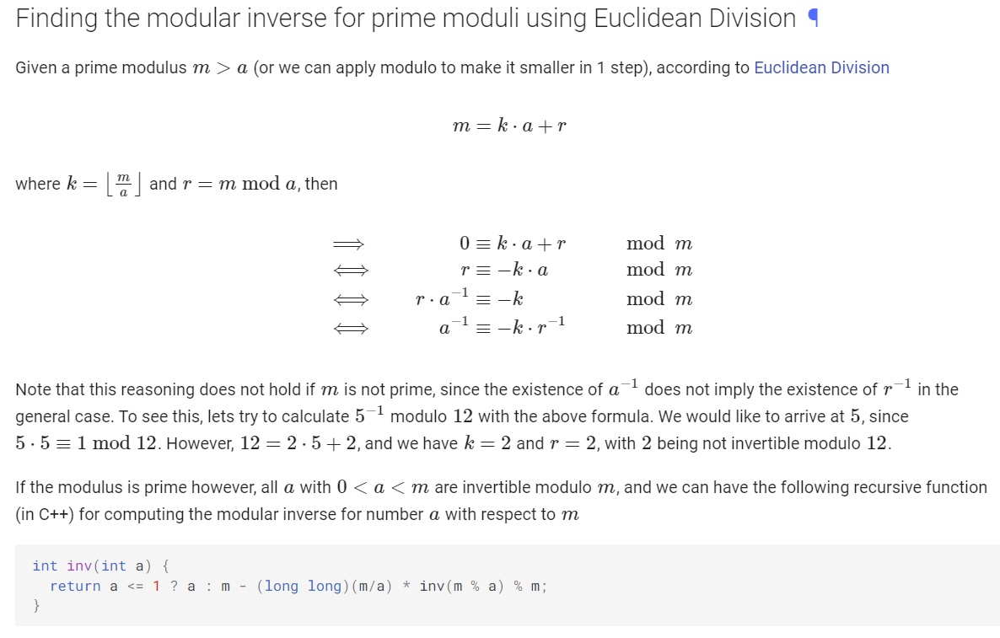

# algorithms

## graph

### dijkstra

```txt
dijkstra = find single source shortest path on graph with positive edge weights
    1. Build graph
        a) adjacency list storing: cost, node 2
    2. Traverse graph using bfs on adjacency list
        a) use priority queue to store and sort edges
        b) update distance array
```

### bellman-ford

```txt
shortest path in graph with negative edge weights
    1. build graph with edge list (node1, node2, cost)
    2. traverse graph with edge list and relax edges to calculate distances
    3. traverse again to check for negative cycles
```

### floyd warshall

```txt
shortest path between all pairs of nodes
    1. initialize 2d distance array with given edges (a to b is cost c)
    2. try all intermediate nodes from a to b to find shortest path
```

### kruskal

```txt
minimum spanning tree
    1. build graph using edge list: store node1, node2
    2. create minimum spanning tree using ufds
        a) union nodes until all nodes are connected
        b) functions: findSet, isSameSet, unionSet
```

### dinic

```txt
maximum flow on dense graph (ev^2)
    1. build graph
        a) edge list with: node1, node2, capacity, flow
    2. bfs: check if sink is reachable from source
        a) traverse graph using edge list
        b) find level of each node and store in level array
    3. dfs: calculate flow through a path
        a) traverse graph until edge is saturated
    4. repeat 2 and 3 until no flow from source to sink
```

### topological sort

```txt
topological sort: order the vertices of a directed graph by precedence
1. build adjacency list (store node2)
2. dfs on adjacency list
    a) try each node as starting point. if not visited, dfs.
    b) keep track of visited and active nodes
    c) if dfs is visiting an already active node, topological sort is impossible
```

### binary lifting

```txt
1. build adjacency list where tar[i][j] is the 2^j-th parent of node i
    a) 2^n-th parent of node x is same as 2^(n-1)-th parent of the 2^(n-1)-th parent of x
2. use method similar to binary exponentiation
```

### strongly connected components

```txt
strongly connected components = can all nodes visit all other nodes?
1. store graph with adjL and rev adjL
2. dfs with adjL and store path
3. dfs with rev adjL
```

### eulerian path

```txt
each edge is visited exactly once
1. store graph with adjL (edge number)
2. traverse with dfs, delete edges once visited

for nodes:
each node is traversed only once
keep track of in and out degree
```

### knight tour - warnsdorff

```txt
move the knight to the position with the most free adjacent edges
```

## tree

### diameter

```txt
max distance from one end of tree to another end
1. dfs to a leaf
2. dfs to farthest point from leaf
```

### lca

```txt
lowest common ancestor
1. build tree with adjL
2. dfs with binary lifting to find ancestors and node depth
3. find ancestor using binary lifting (similar to binary search)
    a) find ancestor of deeper node to make one node equal depth to the other
    b) binary lift: if i-th ancestor is equal, no change (like binary sort taking lower)
        if i-th ancestor is not equal, take as ancestor (like binary sort taking higher)
    c) final answer is parent of ancestor found in b)
```

## math

### binary exponentiation

```txt
break exponent into chunks (logN): 2^4 -> (2^2)^2 -> (2)^4
chaining: if computing a^b^c mod M, b^c must be mod (M-1) if M is odd (euler totient)
```

### linear sieve

```txt
linear sieve: finding divisors
1. check if multiples of a number with an added offset can reach a target
```

### sum divisors

```txt
sum of divisors of first n numbers
group the divisors by the number of times their multiples appear (each appears n/i times)
    e.g., dividing 10 by i = 1 to 10: 10, 5, 3, 2, 1, 1, 1, 1, 1, 1
sum from i=1 to i=n of i*(n/i)
1. find a divisor and find the largest divisor that occurs the same number of times
2. sum the range
```

### modular inverse and binary coefficient

```txt
modular inverse of 2 is (M+1)/2 when M is odd
```

[Euclidian Division](https://cp-algorithms.com/algebra/module-inverse.html#finding-the-modular-inverse-for-prime-moduli-using-euclidean-division)


### multinomial coefficient

```txt
number of ways x different types of elements in a set of size n
n! / ((k1!)*(k2!)*(k3!)*...*(kn!))
```

### sticks and stones

```txt
how many ways to distribute n items to m people?
think of dividers in the set of items and people
```

### derangements

```txt
derangements = permutation with no fixed points (none in same place as original)
there are n-1 points to place an object (can't place in old position)
if the object is placed in a new position, n-1 other objects need to be placed
if the object is swapped with a position, n-2 other objects need to be placed
```

### matrix exponeneitation

```txt
matrix exponentiation: find the nth state (some operation is applied n times)
1. store an initial state and a transition matrix
    what information from current state is needed to transition to next state?
2. use binary exponentiation to exponentiate the matrix
```

## string

### rabin-karp

```txt
rolling hash (sliding window) to find exact pattern string match
similar to math: finding all 4-digit numbers in 40 consecutive digits
1. initialize hash values and base values
2. initialize hash of first n characters
3. hash with sliding window
    a) assign an integer value to all characters
    b) add new character and subtract old character
    c) characters have a base value: abc = 1*100 + 2*10 + 3
```

## range queries

### difference array

```txt
use difference array for efficient range update queries
add when entering the range, subtract when leaving
2d diff array: think of rectangles
    1. add top left (add area starting at top left)
    2. subtract top right and bottom left (subtract area outside of range)
    3. add bottom right (because this area is subtracted twice in step 2)
to calculate net change: add left, add up, subtract diagonal upper left
```
