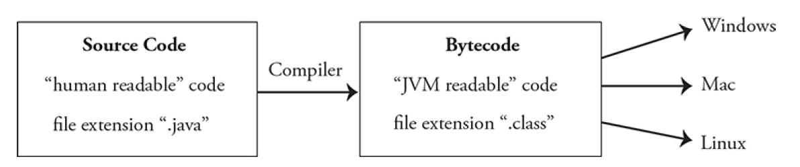

# Unit 0

## what is java

- Java is a general-purpose, object-oriented computer programming language
- Java is machine-independent (run on any platform: Windows, Mac, Linux,etc.).
- Java runs on JVM (translates bytecode into machine code)
- JVM is part of JRE
  
- A compiler is a program that converts Java program into code called bytecode

## Object-Oriented Programming

- uses concept of clsses and objects
  - Classes define how an object will be constructed (instructions)
  - Objects are created from these classes (make from instructions)

## Class heirarchy

- top-down design: begin with parent classes
- bottom-up: start with child classes

## Procedural abstraction

- Every method has a specific job
- Complex tasks are broken down into smaller tasks

## Testing

- Unit tests: test whether or not a specific method is performing its task correctly
  Integration testing: make sure connections to outside resources are working correctly

## Software engineering

- Program specifications: What the program should look like; how it should operate
- Software engineering: study of designing, developing, and maintaining software
- Software development models:
  1. Prototyping
  2. Incremental development
  3. Rapid application development
  4. Agile software development
  5. Waterfall model
