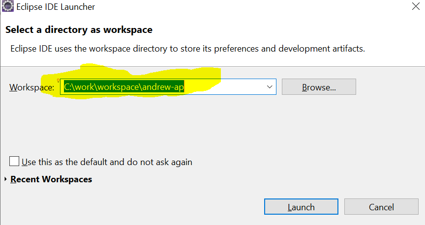
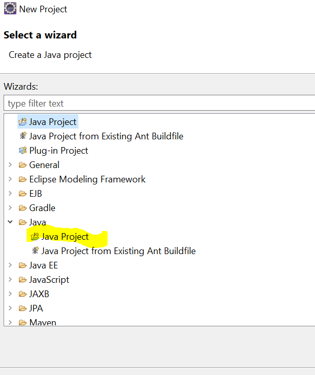
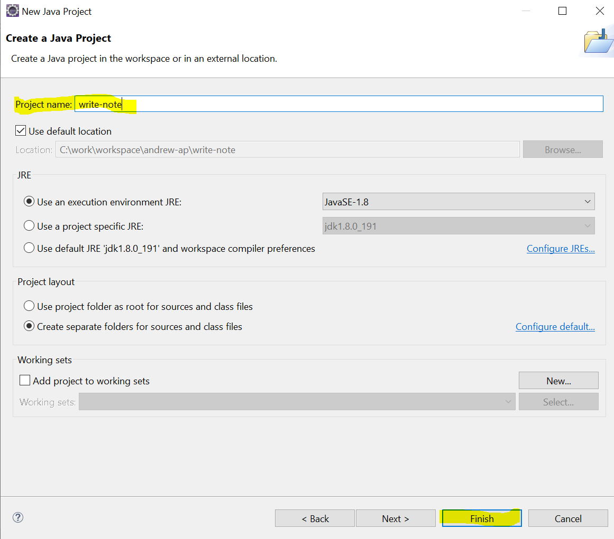
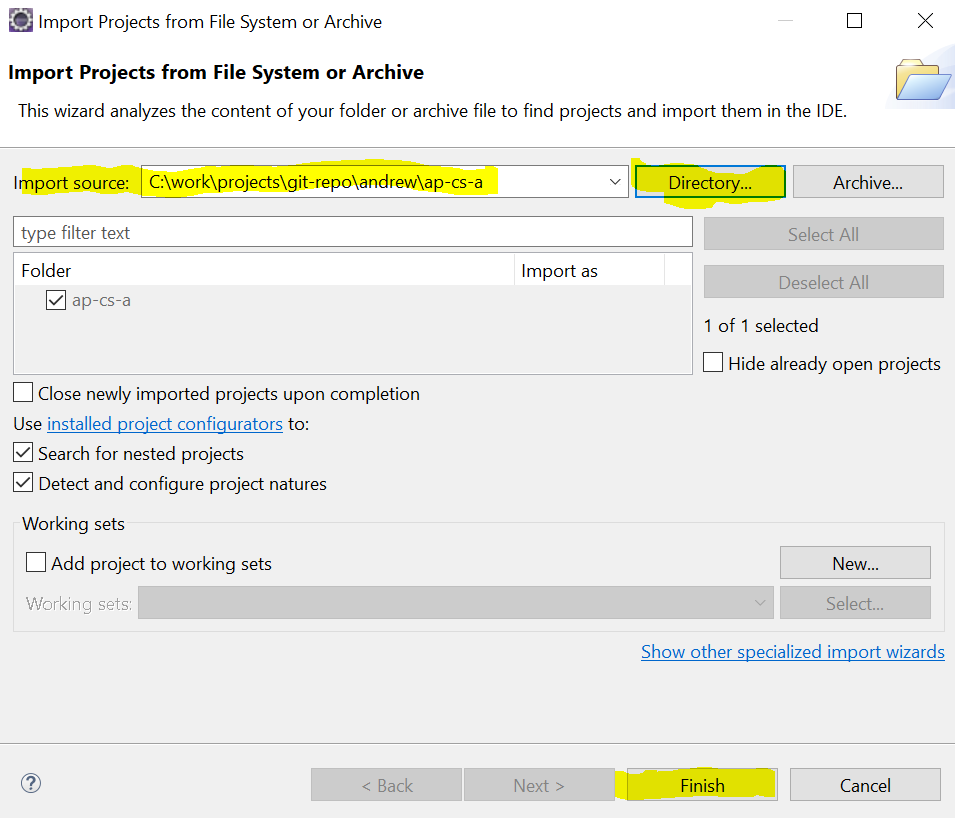
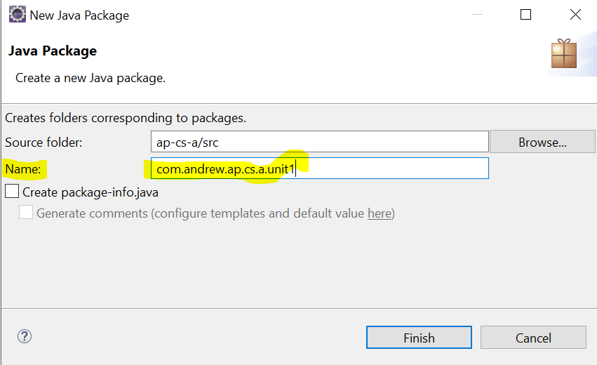
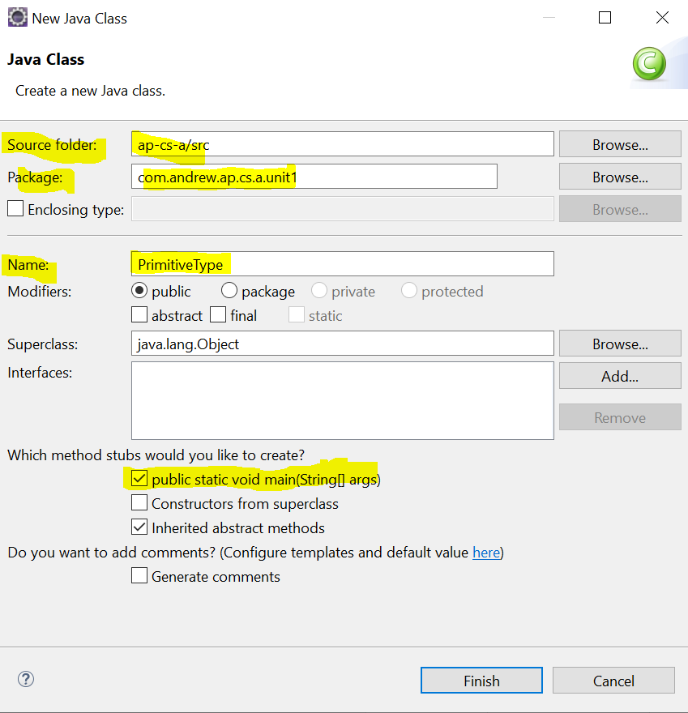

# ap computer science A

markdown reference:

- [markdownguide](https://www.markdownguide.org/cheat-sheet/#basic-syntax)
- https://github.com/adam-p/markdown-here/wiki/Markdown-Cheatsheet

## how to use github

1. create a new repo on github
2. clone the new repo to local:
   - switch to folder to hold the repo on local. e.g. C:\work\projects\git-repo\andrew
     command to use on git bash: $ cd /c/work/projects/git-repo/andrew/
   - clone command: git clone https://andrew-canada@github.com/andrew-canada/ap-cs-a.git
3. do work in repo
4. push from local to github:
   - check if anything new to push to github: git status
   - git add .
   - git commit -m "msg for commit"
   - git push
5. get the latest from github to local
   - git pull

## how to start java project in eclipse

1. create a new workspace
   - open eclipse
   - give a new folder to store workspace at Eclipse IDE Launcher
     
2. create a new java project
   - option#1: create new project
     - File -> New -> project...
       
       
   - option#2: import an existing project from file system
     - File -> open project from file system...
       
3. create a new package
   - right click on src -> new -> package
     
4. create a new class under the new package
   - right click on the new package -> new -> class
     

## what is .gitignore

- .gitignore contains what not to push onto github
